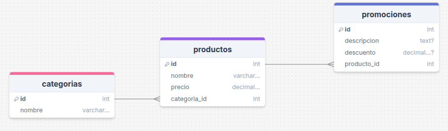
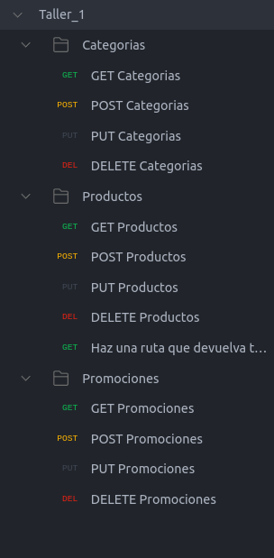

# 📄 Taller_1_PHP_y_MySQL

## Diagrama



## PostMan



## Descripción
Este repositorio contiene el código fuente y los recursos del **Taller 1** desarrollado como parte de un proyecto de aprendizaje para la creación de aplicaciones web utilizando **PHP** y **MySQL**. El taller está diseñado para implementar un sistema básico que permite gestionar datos a través de una interfaz web, interactuando con una base de datos MySQL.

El propósito principal de este taller es aprender los fundamentos de desarrollo web con PHP, incluyendo la conexión a bases de datos MySQL, la creación de consultas SQL, y la implementación de operaciones CRUD (Create, Read, Update, Delete) en un entorno web.

## Características
- **Conexión a MySQL**: Configuración de una conexión segura a una base de datos MySQL utilizando PHP.
- **Operaciones CRUD**: Funcionalidades para listar, agregar, editar y eliminar registros en la base de datos.
- **Interfaz web básica**: Uso de PHP para crear una interfaz de usuario sencilla.

## Requisitos previos
Para ejecutar este proyecto en tu máquina local, necesitas tener instalado lo siguiente:
- **MySQL**para la gestión de la base de datos.
- Un navegador web (Google Chrome, Firefox, etc.).

## Instalación
Sigue estos pasos para configurar el proyecto en tu máquina local:

1. **Clonar el repositorio**:
   ```bash
   git clone https://github.com/NicolasMuskusTarazona/Taller_1_PHP_y_MySQL.git

2. **Editar el archivo de conexión src/config.php**:
   ```bash
    $host = "localhost";
    $db = "taller1";
    $user = "root";
    $pass = "";

3. **Levantar el servidor TERMINAL desde index.php**:

   ```bash
    php -S localhost:8082

## Licencia y Contacto
Proyecto creado con fines educativos.
- Desarrollado por Nicolas Muskus Tarazona
- GitHub: https://github.com/NicolasMuskusTarazona
